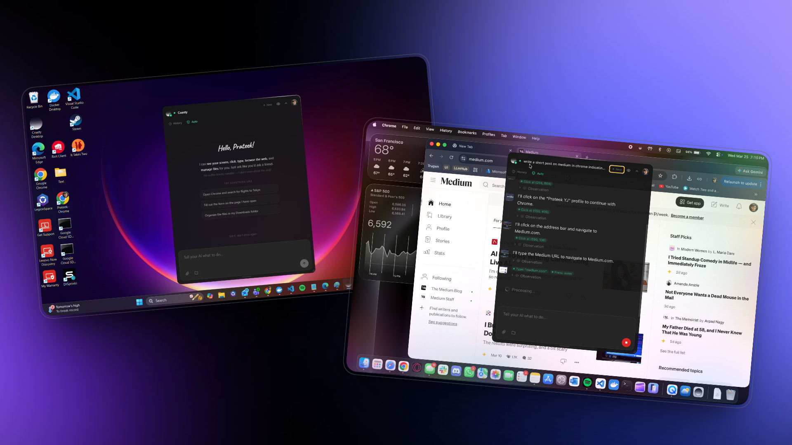
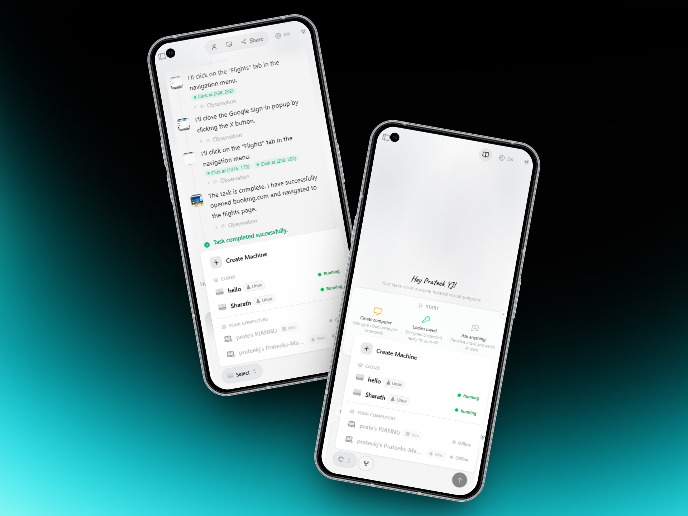

# Autonomous Computer Use Operators
## #1 OS World - 82%

**An AI agent that controls a real computer — browses, clicks, types, and delivers finished work.**

---

<picture>
  
</picture>

  

<picture>
  
</picture>

---

### What is Coasty?

Coasty is a computer-use agent platform ranked **#1 on OSWorld** across 369 real-world tasks. Instead of APIs or scripts, our agents operate computers the way people do — navigating browsers, filling forms, clicking buttons, and handling the unexpected. Each session runs in a **sandboxed virtual machine**, giving agents a full desktop with a real browser while keeping your systems safe.

---

### Platform

<table>
<tr>
<td width="50%" valign="top">

**Computer Use Agent**
A vision-based agent that sees the screen, reasons about what to do next, and executes actions — clicks, keystrokes, scrolling, drag-and-drop — in a continuous screenshot-action loop. No selectors, no integrations, no scripts.

**Agent Swarms**
Decompose a task across multiple machines running in parallel. Each agent operates independently with shared memory, message passing, and coordinated result aggregation. Scale from one machine to dozens.

**Scheduled Automation**
Cron-based task scheduling with timezone support. Agents run unattended on a recurring cadence — hourly, daily, weekly — with agent-to-agent triggers that let one completed job kick off the next.

**Web Research**
Built-in search and scraping at three depth levels — quick, moderate, and deep. Agents can research across multiple sites, synthesize findings, and feed results directly into their next actions.

</td>
<td width="50%" valign="top">

**Desktop App**
A cross-platform Electron overlay that runs agents locally on your own machine. The agent controls your actual desktop — your browser, your apps, your files — with four approval modes from full autonomy to manual review of every action.

**Browser Automation**
Agents launch and control real browser sessions — navigate, click, type, manage tabs, execute JavaScript, and extract page content. Works with Chrome, Edge, and Brave.

**Terminal and File Operations**
Full shell access and filesystem control. Agents can run commands, read and write files, manage directories, and chain terminal operations into complex workflows.

**Credential Management**
Secure server-side credential storage with encrypted lookup and field-filling. Agents never see raw secrets — the backend injects values directly into form fields on their behalf.

</td>
</tr>
</table>

---

### Architecture

<table>
<tr>
<td width="33%" valign="top">

**Sandboxed VMs**
Every session runs in an isolated environment — Azure Container Instances or AWS EC2. Full Ubuntu desktop with XFCE, Chrome, and a WebSocket agent bridge. Nothing persists after termination.

</td>
<td width="33%" valign="top">

**Streaming Interface**
All agent reasoning, actions, tool calls, and results stream in real time via SSE. Complete visibility into what the agent is doing and why, with full screenshot history.

</td>
<td width="33%" valign="top">

**Multi-Model Support**
Backed by Claude Sonnet 4, Claude 3.5 Sonnet, Claude 3 Haiku, Llama 3.2, and Amazon Nova — all routed through Amazon Bedrock. Bring your own API keys for direct provider access.

</td>
</tr>
</table>

---

### Additional Capabilities

| Feature | Description |
|---|---|
| **Agent Labs** | Template-based agent deployments — create reusable workflows and share them across your team |
| **Collaborative Rooms** | Real-time shared sessions where multiple users can observe and interact with a running agent |
| **Agent Delegation** | Agents can invoke other agents mid-task, up to 3 levels deep, for specialized sub-workflows |
| **Self-Correction** | Agents detect and recover from CAPTCHAs, popups, unexpected dialogs, and layout changes |
| **Audit Trail** | Every action logged with timestamps and screenshots for full transparency and compliance |
| **BYOK Encryption** | User-provided API keys encrypted with AES-GCM and stored securely — never logged or exposed |
| **Credit-Based Billing** | Pay only for compute time. Free tier included, with plans from $9 to $100/month |
| **Cross-Platform Desktop** | Native installers for Windows, macOS, and Linux with auto-updates |

---

### Use Cases

**QA and Testing** — Walk through real UIs, validate multi-step workflows, catch visual and functional regressions that unit tests miss.

**Sales Prospecting** — Research leads across LinkedIn, company sites, and databases. Compile structured reports without manual tab-switching.

**Data Entry and Migration** — Move data between systems that lack APIs. Fill forms, copy records, reconcile spreadsheets across applications.

**Job Applications** — Fill and submit applications across multiple job boards at scale with personalized inputs.

**Web Research** — Deep multi-site research with configurable depth, structured extraction, and automatic summarization.

**Workflow Automation** — Anything you would do manually in a browser, terminal, or desktop application.

---

**[Get started](https://coasty.ai)** · **[Download the desktop app](https://coasty.ai/download)** · **[Watch demos](https://coasty.ai/#use-cases)**

